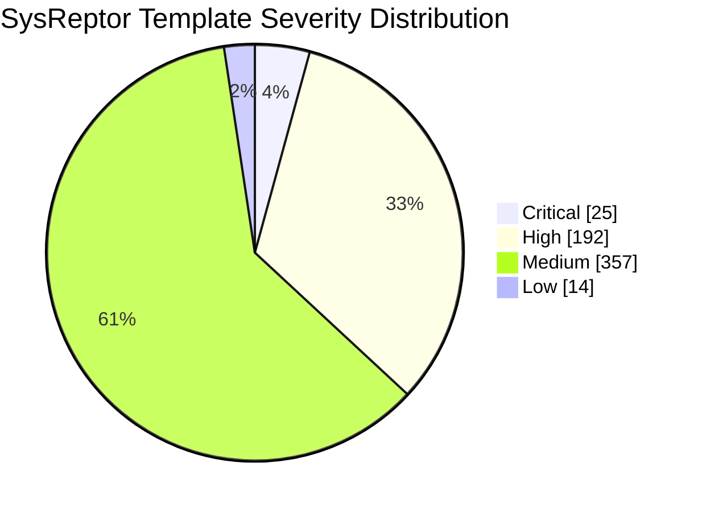

# SysReptor Bugcrowd Templates

[Turkish](README.tr.md) | [English](README.md)


A bilingual import package for using Bugcrowd report templates as SysReptor Finding Templates.

The package includes both English and Turkish template content and can be imported directly through the SysReptor web interface.

> This is not an official Bugcrowd or SysReptor release.

## Quick Summary

| Field | Value |
| --- | ---: |
| Total finding templates | `588` |
| Language support | `en-US`, `tr-TR` |
| SysReptor web import package | `sysreptor-bugcrowd-templates.tr.tar.gz` |
| Web import package size | `384K` |
| JSON package size | `2.6M` |
| Placeholder validation | `0` mismatches |
| Last validation | `2026-07-04` |

## Severity Distribution

| Severity | Count | Ratio |
| --- | ---: | ---: |
| Critical | `25` | `4.3%` |
| High | `192` | `32.7%` |
| Medium | `357` | `60.7%` |
| Low | `14` | `2.4%` |
| **Total** | **`588`** | **`100%`** |



## Covered Vulnerability Categories

| Category | Templates |
| --- | ---: |
| Active Directory | `24` |
| AI Application Security | `32` |
| Algorithmic Biases | `3` |
| Application Level Denial of Service (DoS) | `8` |
| Automotive Security Misconfiguration | `40` |
| Blockchain Infrastructure Misconfiguration | `2` |
| Broken Access Control | `12` |
| Broken Authentication and Session Management | `29` |
| Client-Side Injection | `5` |
| Cloud Security | `15` |
| Cross-Site Request Forgery (CSRF) | `10` |
| Cross-Site Scripting (XSS) | `18` |
| Cryptographic Weakness | `40` |
| Data Biases | `3` |
| Decentralized Application Misconfiguration | `23` |
| Developer Biases | `2` |
| External Behavior | `13` |
| Indicators of Compromise | `1` |
| Insecure Data Storage | `8` |
| Insecure Data Transport | `5` |
| Insecure OS/Firmware | `20` |
| Insufficient Security Configurability | `24` |
| Lack of Binary Hardening | `5` |
| Misinterpretation Biases | `2` |
| Mobile Security Misconfiguration | `7` |
| Network Security Misconfiguration | `2` |
| Physical Security Issues | `6` |
| Privacy Concerns | `3` |
| Protocol Specific Misconfiguration | `5` |
| Sensitive Data Exposure | `46` |
| Server Security Misconfiguration | `107` |
| Server-Side Injection | `29` |
| Smart Contract Misconfiguration | `15` |
| Societal Biases | `3` |
| Unvalidated Redirects and Forwards | `8` |
| Using Components with Known Vulnerabilities | `6` |
| Zero Knowledge Security Misconfiguration | `7` |

## Contents

| Content | Status |
| --- | --- |
| SysReptor Finding Templates | Ready |
| English template text | Included |
| Turkish template text | Included |
| Severity fields | Included |
| Tags | Included |
| Web UI import archive | Included |

## Preview

English template view:


Turkish template view:


## Published Files

| File | Description |
| --- | --- |
| `sysreptor-bugcrowd-templates.tr.tar.gz` | Main package for importing through the SysReptor web interface |
| `sysreptor-bugcrowd-templates.tr.json` | Full JSON package with English and Turkish translations |
| `sysreptor-bugcrowd-templates.json` | English SysReptor template JSON output |

## Import

### SysReptor Web UI

Upload the following file in the SysReptor finding template import area:

```text
sysreptor-bugcrowd-templates.tr.tar.gz
```

This file is the recommended package for web UI import.

### SysReptor CLI

To import the English + Turkish package with the CLI:

```bash
cat sysreptor-bugcrowd-templates.tr.json | reptor template
```

For the English-only package:

```bash
cat sysreptor-bugcrowd-templates.json | reptor template
```

## Validation

Package validation summary:

| Check | Result |
| --- | ---: |
| JSON template count | `588` |
| `en-US` translations | `588` |
| `tr-TR` translations | `588` |
| Placeholder mismatches | `0` |
| Severity distribution | Preserved |
| Tar archive template count | `588` |

## Integrity

```text
70160a9239dfb9c9f56d9413292e66edfea9b6c110dda23be8d6b13fafd853b6  sysreptor-bugcrowd-templates.tr.tar.gz
```

## Language Note

The Turkish text is kept suitable for security report writing. Technical terms are left in English where appropriate or used together with their Turkish equivalents.

Preserved fields:

- SysReptor placeholders: `{{URL}}`, `{{screenshot}}`, `{{request}}`, etc.
- Markdown code blocks
- URL references
- HTTP header and command examples
- Standard security references such as CVE, OWASP, and CWE

## Usage Note

This package provides a starting point for faster report writing. Each finding should still be reviewed according to the target context, impact, exploitability, and program rules.

## License

Upstream repository: Bugcrowd `templates`. The upstream repository is licensed under GPL-3.0; redistribution and use should take GPL-3.0 obligations and upstream attribution requirements into account.

## References

- [Bugcrowd templates repository](https://github.com/bugcrowd/templates)
- [Bugcrowd templates license](https://github.com/bugcrowd/templates/blob/master/LICENSE)
- [SysReptor CLI template documentation](https://docs.sysreptor.com/cli/projects-and-templates/template/)
- [SysReptor multilingual finding templates](https://docs.sysreptor.com/finding-templates/multilingual/)
