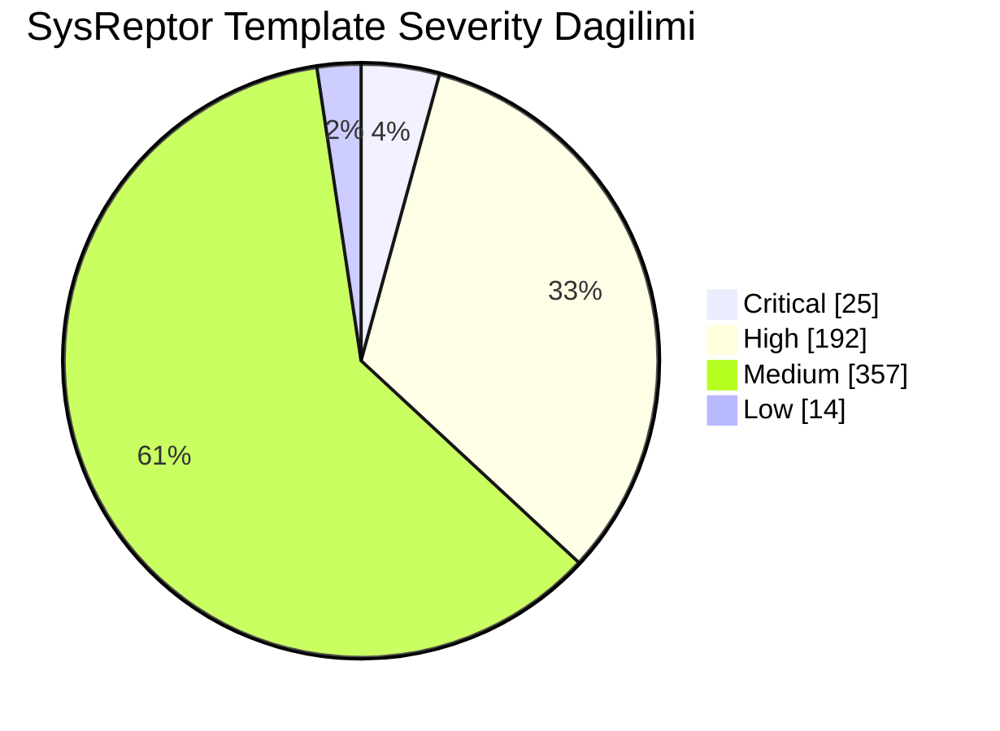
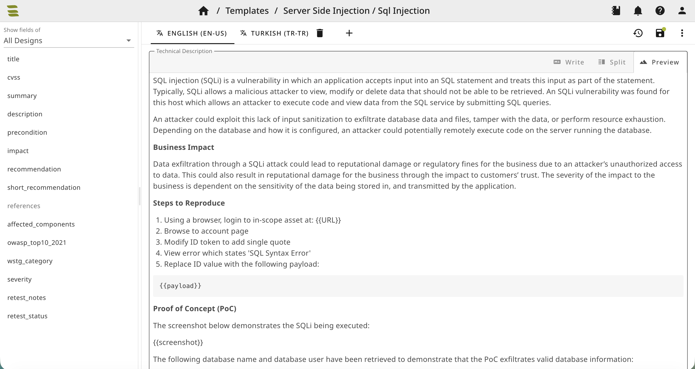
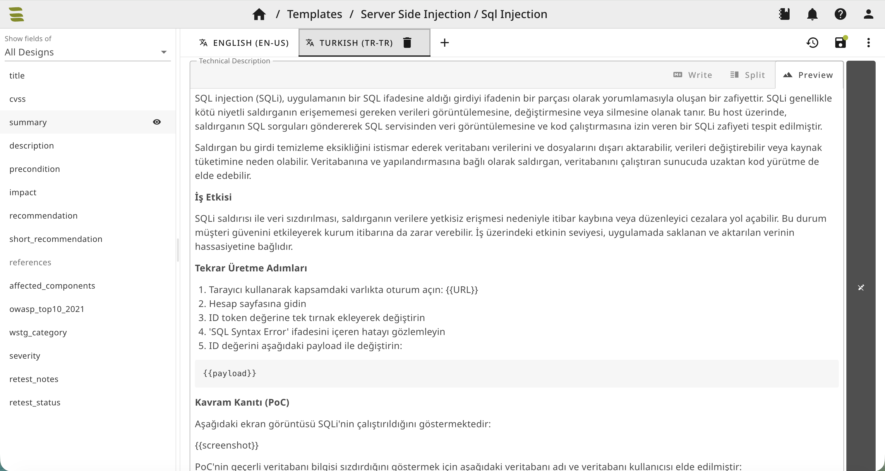

# SysReptor Bugcrowd Templates TR

[Türkçe](README.md) | [English](README.en.md)


Bugcrowd rapor şablonlarını SysReptor Finding Template olarak kullanmak isteyenler için iki dilli import paketidir.

Paket, İngilizce ve Türkçe template içeriklerini birlikte sunar ve SysReptor web arayüzünden doğrudan içe aktarılabilir.

> Resmi bir Bugcrowd veya SysReptor yayını değildir.

## Hızlı Özet

| Alan | Değer |
| --- | ---: |
| Toplam finding template | `588` |
| Dil desteği | `en-US`, `tr-TR` |
| SysReptor web import paketi | `sysreptor-bugcrowd-templates.tr.tar.gz` |
| Web import paket boyutu | `384K` |
| JSON paket boyutu | `2.6M` |
| Placeholder doğrulaması | `0` uyuşmazlık |
| Son doğrulama | `2026-07-04` |

## Severity Dağılımı

| Severity | Adet | Oran |
| --- | ---: | ---: |
| Critical | `25` | `4.3%` |
| High | `192` | `32.7%` |
| Medium | `357` | `60.7%` |
| Low | `14` | `2.4%` |
| **Toplam** | **`588`** | **`100%`** |



## Ne İçeriyor?

| İçerik | Durum |
| --- | --- |
| SysReptor Finding Templates | Hazır |
| İngilizce template metinleri | Var |
| Türkçe template metinleri | Var |
| Severity alanları | Var |
| Tag bilgileri | Var |
| Web UI import arşivi | Var |

## Örnek Görünüm

İngilizce template görünümü:



Türkçe template görünümü:



## Yayınlanacak Dosyalar

| Dosya | Açıklama |
| --- | --- |
| `sysreptor-bugcrowd-templates.tr.tar.gz` | SysReptor web arayüzünden import edilecek ana paket |
| `sysreptor-bugcrowd-templates.tr.json` | İngilizce ve Türkçe çevirileri içeren tam JSON |
| `sysreptor-bugcrowd-templates.json` | İngilizce SysReptor template JSON çıktısı |

## Import

### SysReptor Web UI

SysReptor arayüzünden finding template import alanına şu dosyayı yükleyin:

```text
sysreptor-bugcrowd-templates.tr.tar.gz
```

Bu dosya web arayüzü import kullanımı için önerilen pakettir.

### SysReptor CLI

İngilizce + Türkçe sürümü CLI ile yüklemek için:

```bash
cat sysreptor-bugcrowd-templates.tr.json | reptor template
```

Yalnızca İngilizce kaynak çıktı için:

```bash
cat sysreptor-bugcrowd-templates.json | reptor template
```

## Doğrulama

Paket için doğrulama özeti:

| Kontrol | Sonuç |
| --- | ---: |
| JSON template sayısı | `588` |
| `en-US` çevirisi | `588` |
| `tr-TR` çevirisi | `588` |
| Placeholder uyuşmazlığı | `0` |
| Severity dağılımı | Korundu |
| Tar arşivi template sayısı | `588` |

## Bütünlük

```text
70160a9239dfb9c9f56d9413292e66edfea9b6c110dda23be8d6b13fafd853b6  sysreptor-bugcrowd-templates.tr.tar.gz
```

## Dil Notu

Türkçe metinler güvenlik raporu diline uygun tutulmuştur. Teknik terimler gerektiği yerde İngilizce bırakılmış veya Türkçe karşılığıyla birlikte kullanılmıştır.

Korunan alanlar:

- SysReptor placeholder'ları: `{{URL}}`, `{{screenshot}}`, `{{request}}` vb.
- Markdown kod blokları
- URL referansları
- HTTP header ve komut örnekleri
- CVE, OWASP, CWE gibi standart güvenlik referansları

## Kullanım Notu

Bu paket, rapor yazımını hızlandırmak için başlangıç noktası sağlar. Her bulgu, gerçek hedefin bağlamına, etkiye, istismar edilebilirliğe ve program kurallarına göre gözden geçirilmelidir.

## Lisans

Upstream repository: Bugcrowd `templates`. Upstream repository GPL-3.0 lisanslıdır; paylaşım ve kullanım sırasında GPL-3.0 yükümlülükleri ile upstream atıf gereklilikleri dikkate alınmalıdır.

## Referanslar

- [Bugcrowd templates repository](https://github.com/bugcrowd/templates)
- [Bugcrowd templates license](https://github.com/bugcrowd/templates/blob/master/LICENSE)
- [SysReptor CLI template documentation](https://docs.sysreptor.com/cli/projects-and-templates/template/)
- [SysReptor multilingual finding templates](https://docs.sysreptor.com/finding-templates/multilingual/)
- [OWASP Vulnerable and Outdated Components](https://owasp.org/Top10/A06_2021-Vulnerable_and_Outdated_Components/)
- [OWASP Unvalidated Redirects and Forwards Cheat Sheet](https://cheatsheetseries.owasp.org/cheatsheets/Unvalidated_Redirects_and_Forwards_Cheat_Sheet.html)
- [OWASP Server-Side Request Forgery Prevention Cheat Sheet](https://cheatsheetseries.owasp.org/cheatsheets/Server_Side_Request_Forgery_Prevention_Cheat_Sheet.html)
- [OWASP File Upload Cheat Sheet](https://cheatsheetseries.owasp.org/cheatsheets/File_Upload_Cheat_Sheet.html)
- [OWASP Content Security Policy Cheat Sheet](https://cheatsheetseries.owasp.org/cheatsheets/Content_Security_Policy_Cheat_Sheet.html)
- [CWE-804: Guessable CAPTCHA](https://cwe.mitre.org/data/definitions/804.html)
